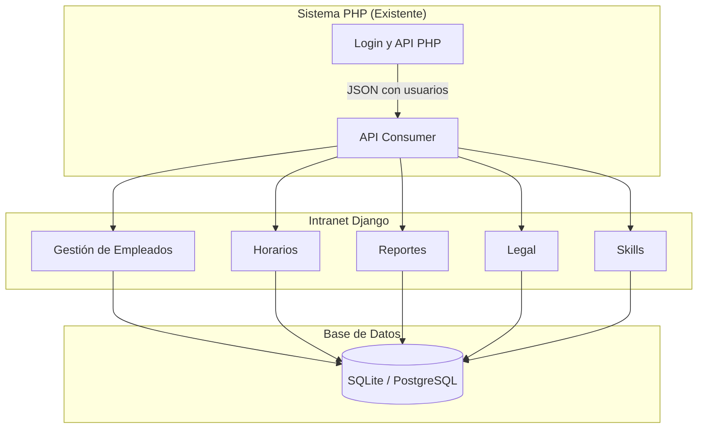

# 🏥 Intranet de Gestión Empresarial - HDES

Este proyecto es la **evolución de la intranet** para una cadena de boticas.  
Mientras que el software existente en **PHP** ya cubre **ventas e inventario**,  
este nuevo sistema en **Django** se centra en la **gestión integral del personal** y la **administración organizacional**.

👉 El objetivo es **complementar** el sistema existente, no reemplazarlo.  

---

## 📋 Índice

- [Introducción](#introducción)
- [Objetivos](#objetivos)
- [Módulos](#módulos)
- [Arquitectura](#arquitectura)
- [Instalación](#instalación)
- [API y Autenticación](#api-y-autenticación)
- [Pruebas](#pruebas)
- [Capturas de Pantalla](#capturas-de-pantalla)
- [Planes Futuros](#planes-futuros)
- [Licencia](#licencia)

---

## 📖 Introducción

La intranet en Django permitirá **centralizar la gestión de la empresa** más allá de las ventas.  
Los módulos clave son:  

- 👩‍💼 **Gestión de empleados y horarios**  
- 📑 **Reportes individuales** (historial salarial, desempeño, asistencia)  
- ⚖️ **Módulo legal** (contratos, acuerdos, documentos firmados)  
- ⭐ **Skills**: asignar y evaluar habilidades de cada trabajador (ejemplo: Caja, Ventas, Almacén) con niveles representados en estrellas.  

Además, el sistema se integrará con el **software PHP** existente a través de una **API** que permitirá:  

1. **Login centralizado**: la autenticación seguirá ocurriendo en el sistema PHP.  
2. **Consumo de datos de usuario vía JSON**: este intranet usará la API para mostrar el historial del trabajador.  

---

## 🎯 Objetivos

- **Complementar, no reemplazar**: trabajar junto al sistema PHP de inventario/ventas.  
- **Unificar gestión**: horarios, reportes, contratos, habilidades.  
- **Historial transparente**: que cada trabajador tenga un registro completo (salarios, habilidades, asistencia).  
- **Escalabilidad**: modularidad para añadir nuevas funciones sin afectar lo existente.  
- **Integración API**: consumir usuarios del sistema PHP con seguridad (tokens).  

---

## 🧩 Módulos

| Módulo         | Funcionalidad                                                                 |
|----------------|-------------------------------------------------------------------------------|
| **Empleados**  | Alta/baja de empleados, asignación de roles, visualización de historial.      |
| **Horarios**   | Registro y asignación de turnos semanales con control de asistencias.         |
| **Reportes**   | Historial de salario, desempeño y métricas individuales.                      |
| **Legal**      | Contratos laborales y documentos asociados a cada trabajador.                 |
| **Skills**     | Asignación de habilidades: Ej. *Caja*, *Ventas*, *Almacén*, con niveles ⭐⭐⭐. |

---

## 🏗 Arquitectura



---

## 🚀 Instalación

### 1. Clonar repositorio

```
git clone https://github.com/giancarlovilch/HDES.git
cd HDES
```

### 2. Crear entorno virtual

```
python -m venv venv
source venv/bin/activate   # Windows: .\venv\Scripts\activate
```

### 3. Instalar dependencias

```
pip install -r requirements.txt
```

### 4. Migraciones y datos iniciales

```
python manage.py migrate
python manage.py load_initial_data
```

### 5. Ejecutar servidor

```
python manage.py runserver
```

Ir a 👉 http://127.0.0.1:8000/

---

## 🔑 API y Autenticación

Este intranet no gestiona el **login principal**.
 La autenticación proviene del **sistema PHP** vía **API REST**.

### Flujo esperado:

1. Usuario inicia sesión en la web PHP.
2. PHP genera un **token** y lo expone en la API.
3. Django consume el endpoint con ese token y obtiene el perfil del usuario.

Ejemplo JSON simulado:

```
{
  "id": 12,
  "username": "jlopez",
  "nombre": "Juan Lopez",
  "rol": "Empleado",
  "skills": ["Caja", "Ventas"]
}
```

⚠️ En desarrollo:

- Usamos un **archivo JSON de prueba** (`/fixtures/mock_users.json`) para emular la API.
- En producción: se reemplazará con el endpoint real en PHP.

---

## 🧪 Pruebas

Ejecutar pruebas:

```
python manage.py test
```

Pruebas iniciales incluyen:

- Crear empleados y asignar skills.
- Asignación de horarios sin duplicados.
- Reinicio de asignaciones.

---

## 📚 Documentación

La documentación extendida se encuentra en la carpeta [`docs/`](docs/):

- git.md → Flujo Git y buenas prácticas.
- develop.md → Rama de integración.
- featurelogin.md → Módulo de login.
- featureregister.md → Registro de usuarios.
- hotfixdb.md → Base de datos y modelos.

------

## 📸 Capturas de Pantalla

- Dashboard
- Módulo Skills

---

## 📅 Planes Futuros

- 🔄 Conectar API PHP real con autenticación por token.
- 🔄 Generar reportes PDF (contratos y desempeño).
- 🔄 Integración con correo para notificaciones automáticas.
- 🔄 Skills avanzados (niveles, certificaciones).

---

## 📄 Licencia

Este proyecto está bajo licencia MIT.
 Ver [LICENSE](LICENSE) para más detalles.

---

