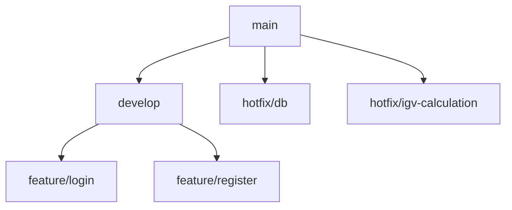

# GIT - HDES

```
https://github.com/giancarlovilch/HDES.git
git init
git remote add origin 
git branch -M main
git pull origin main
git pull --set-upstream origin master
git clone https://github.com/giancarlovilch/HDES.git

```

```
python -m venv HDES
cd HDES
.\Scripts\activate.bat
```

```
paste project
cd sb_schedule
pip freeze > requirements.txt
pip install -r requirements.txt
python manage.py runserver
```

```
python manage.py makemigrations schedule
python manage.py migrate
```

```
pip install django-extensions pydotplus
python manage.py graph_models -a -o models.png
python manage.py inspectdb

```

```
python manage.py changepassword admin
python manage.py createsuperuser

```

```
deactivate

```




### **main**

- Rama principal y estable.
- Contiene el código probado y listo para producción.
- Solo se actualiza desde `develop` (cuando se libera una versión) o desde `hotfix/*` (arreglos urgentes).

------

### **develop**

- Rama de integración de nuevas funcionalidades.
- Todas las ramas `feature/*` se fusionan primero aquí.
- Es el entorno de pruebas antes de pasar a `main`.

------

### **feature**

- Ramas de nuevas funcionalidades o módulos específicos.
- Siempre parten de `develop`.
- Al terminar, se integran nuevamente a `develop`.

Ejemplos en tu proyecto:

- **`feature/login`** → desarrollo del sistema de autenticación de usuarios.
- **`feature/register`** → desarrollo del módulo de registro de usuarios.

------

### **hotfix**

- Ramas de correcciones urgentes en producción.
- Siempre parten de `main` (porque el error ya está en producción).
- Al terminar, se fusionan en `main` y en `develop` (para que el fix no se pierda).

Ejemplos en tu proyecto:

- **`hotfix/db`** → corrección rápida en la configuración o conexión de base de datos.
- **`hotfix/igv-calculation`** → corrección urgente en el cálculo del IGV en facturación.
