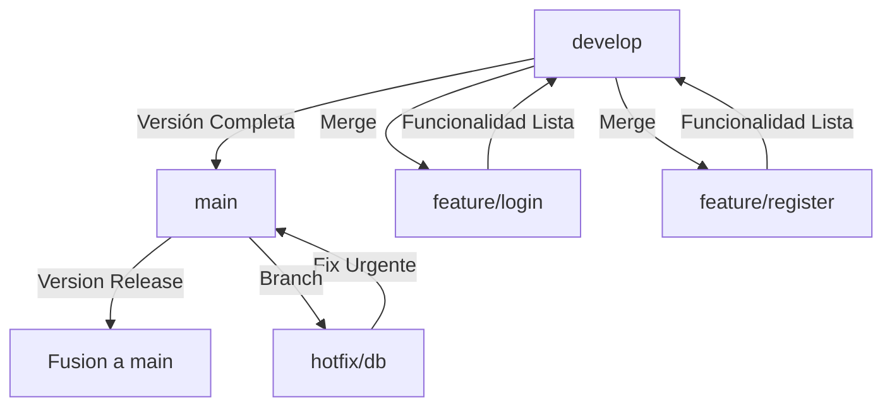

# 🏥 Intranet Cadena de Boticas (HDES)

Bienvenido a SB Intranet, el sistema de intranet desarrollado en Django para gestionar operaciones diarias en una cadena de boticas (farmacias). Este proyecto centraliza módulos clave como inventarios, ventas, reportes, horarios de empleados, proveedores y cuentas, facilitando una administración eficiente y segura desde un solo punto.

[](https://www.djangoproject.com/)  
[](https://www.python.org/)  
[](https://getbootstrap.com/)  
[](LICENSE)

**Repositorio**: [https://github.com/giancarlovilch/HDES.git](https://github.com/giancarlovilch/HDES.git)  
**Estado**: En Desarrollo Activo 🚀

---

## 📋 Índice
- [Introducción](#introducción)
- [Objetivos](#objetivos)
- [Tecnologías y Desarrollo](#tecnologías-y-desarrollo)
- [Instalación](#instalación)
- [Uso](#uso)
- [Flujo de Git (Gitflow)](#flujo-de-git-gitflow)
- [Documentación](#documentación)
- [Planes Futuros](#planes-futuros)
- [Contribuciones](#contribuciones)
- [Licencia](#licencia)

---

## 📖 Introducción

SB Intranet es una intranet modular diseñada para optimizar la gestión de una cadena de boticas. Construida con Django, permite a administradores, empleados y gerentes acceder a herramientas integradas desde un navegador. Las funcionalidades principales incluyen asignación de horarios, control de inventarios, registro de ventas y generación de reportes, con un enfoque en la autonomía y la escalabilidad.

Este proyecto nace de la necesidad de digitalizar procesos manuales en boticas, reduciendo errores y tiempos. Es ideal para cadenas medianas que buscan una solución interna personalizable, segura y gratuita.

---

## 🎯 Objetivos

- **Centralización de Datos**: Unificar información de ventas, inventarios y empleados en una plataforma web unificada.
- **Eficiencia Operacional**: Automatizar tareas repetitivas como asignación de horarios y alertas de stock bajo.
- **Seguridad y Acceso**: Implementar autenticación robusta con roles (admin, empleado, gerente) para proteger información sensible.
- **Escalabilidad**: Arquitectura modular para agregar nuevas funcionalidades sin afectar el core.
- **Interfaz Amigable**: Usar Bootstrap para una experiencia responsive y accesible en cualquier dispositivo.
- **Ahorro de Costos**: Solución open-source, reduciendo la dependencia de sistemas externos propietarios.

---

## 🔧 Tecnologías y Desarrollo

- **Backend**: Django 4.2 (framework web en Python) – Maneja la lógica, modelos de datos y APIs.
- **Frontend**: HTML5, CSS3, JavaScript con Bootstrap 5.3 – Para una UI moderna y responsiva.
- **Base de Datos**: SQLite (desarrollo) / PostgreSQL (producción) – Almacena datos de usuarios, productos, ventas, etc.
- **Autenticación**: Django Auth – Sistema integrado para login/registro con roles personalizados.
- **Entorno**: Python 3.8+ en un virtualenv – Para aislamiento y manejo de dependencias.
- **Control de Versiones**: Git con flujo Gitflow – Para desarrollo colaborativo y versiones estables.
- **Otras Librerías**: Pillow (imágenes), django-crispy-forms (formularios), etc. (ver `requirements.txt`).

La estructura del proyecto sigue la convención estándar de Django: apps modulares (`schedule`, `inventory`, `sales`, etc.) en `sb_schedule/`, con templates globales y locales por necesidad.

---

## 🚀 Instalación

### Prerrequisitos
- **Python 3.8+** instalado en tu sistema.
- **Git** para clonar el repositorio.

### Pasos

**Clona el Repositorio**:

```bash
git clone https://github.com/giancarlovilch/HDES.git
cd HDES
```

**Configura el Entorno Virtual**:

```
python -m venv venv
source venv/bin/activate  # En Windows: .\Scripts\activate.bat
```

**Instala Dependencias**:

```
pip install -r requirements.txt  # Si no tienes el archivo, ejecuta pip freeze > requirements.txt después
```

**Configura la Base de Datos**:

```
python manage.py makemigrations  # Crea migraciones para todas las apps
python manage.py migrate  # Aplica cambios en la DB
```

**Ejecuta el Servidor**:

```
python manage.py runserver
```

Ve a `http://127.0.0.1:8000/` en tu navegador.

------

## 💻 Uso

- **Acceso**: Regístrate o inicia sesión si configuraste autenticación.
- **Navegación**: Usa el navbar para acceder a módulos (Inventario, Ventas, Horarios, etc.).
- **Admin**: En `/admin/`, accede al panel de Django para gestionar datos avanzados.
- **Pruebas**: Crea usuarios, productos y asientos para probar funcionalidades como asignación de horarios.

Ejemplo: Para gestionar inventarios, ve a `Inventario > Ver Stock` y añade productos.

------

## 🌊Flujo de Git (Gitflow)

Usamos el modelo Gitflow para un desarrollo organizado. Aquí el diagrama:



```
git branch -r
 origin/HEAD -> origin/main
  origin/develop
  origin/feature/login
  origin/feature/register
  origin/hotfix/db
  origin/main
 
git push origin main:develop --force
git push origin main:feature/login --force
git push origin main:feature/register --force
git push origin main:hotfix/db --force
```


### Explicación de Ramas

- **main**: Rama estable. Puerta a producción. Solo merges desde `develop` o `hotfix`.
- **develop**: Rama de integración. Todas las nuevas funcionalidades van aquí primero.
- **feature/***: Ramas para nuevas características. Parten de `develop` y regresan ahí al terminar.
- **hotfix/***: Ramas para correcciones urgentes. Parten de `main` y fusionan a `main` y `develop`.

Comandos Básicos:

```
git checkout -b feature/nueva-funcionalidad  # Crear rama
git add .
git commit -m "Descripción"
git push origin feature/nueva-funcionalidad
```

------

## 📚 Documentación

Para más detalles técnicos:

- **Guía de Usuario**: Consulta `docs/usuario.md` para tutoriales sobre cada módulo (inventarios, ventas, horarios).
- **API/Endpoints**: Ver `docs/api.md` para listas de URLs y vistas en Django.
- **Contribuciones**: Guía en `docs/contribuciones.md` si quieres colaborar.
- **Modelos y Databases**: Diagrama ER en `docs/modelos.md`.
- **Django Docs Oficial**: https://docs.djangoproject.com/ para referencias avanzadas.

Si encuentras errores, abre un issue en GitHub.

------

## 📄 Licencia

Este proyecto está bajo la Licencia MIT. Ver [LICENSE](https://openrouter.ai/LICENSE) para más detalles.
