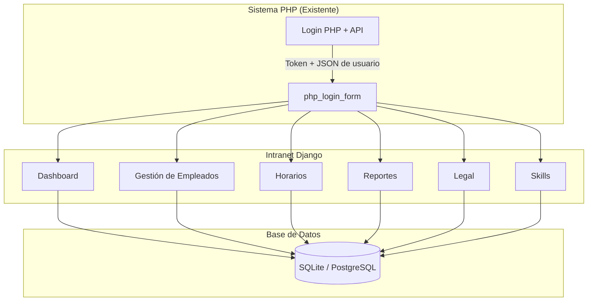

# 🏥 HDES - Intranet de Gestión Empresarial

Este proyecto es la **evolución de la intranet** para una cadena de boticas.  
Mientras que el sistema existente en **PHP** gestiona **ventas e inventario**,  
este nuevo sistema en **Django** se centra en la **gestión integral de personal**, **reportes** y **administración organizacional**.

👉 Django **no reemplaza al sistema PHP**, sino que lo complementa a través de **APIs seguras**.

---

## 📋 Índice

- [Introducción](#introducción)
- [Objetivos](#objetivos)
- [Módulos](#módulos)
- [Arquitectura](#arquitectura)
- [Instalación](#instalación)
- [API y Autenticación](#api-y-autenticación)
- [Pruebas](#pruebas)
- [Capturas de Pantalla](#capturas-de-pantalla)
- [Planes Futuros](#planes-futuros)
- [Licencia](#licencia)

---

## 📖 Introducción

La intranet en Django centraliza la gestión de la empresa más allá de las ventas.  
Se integra con el sistema PHP existente para ofrecer:

- 👩‍💼 **Gestión de empleados y horarios**
- 📑 **Reportes individuales** (salarios, desempeño, asistencia)
- ⚖️ **Módulo legal** (contratos, acuerdos, documentos)
- ⭐ **Skills** (habilidades con niveles representados en estrellas)
- 📊 **Dashboard responsive** con estadísticas clave

El sistema aprovecha el **login centralizado de PHP** y expone su propia API REST para consumo desde aplicaciones externas (ej. apps móviles o Postman).

---

## 🎯 Objetivos

- **Complementar el sistema PHP** → no reemplazarlo.
- **Unificar la gestión** → horarios, reportes, contratos y habilidades.
- **Historial completo** → cada empleado con registros de salario, skills y asistencias.
- **Seguridad API** → autenticación mediante token PHP.
- **UI moderna** → dashboard con Bootstrap 5 y responsive para móviles.

---

## 📌 Definición del problema

La empresa contaba únicamente con un sistema en **PHP** orientado a **ventas e inventario**.  
Esto generaba limitaciones:

- ❌ No existía gestión integral de **empleados y horarios**.  
- ❌ No había historial de **reportes de desempeño y salarios**.  
- ❌ La administración de **skills** o **documentos legales** no estaba contemplada.  
- ❌ Interfaz poco moderna y limitada a escritorio.  

**Problema central:**  
La falta de un sistema de gestión integrado para el personal y la operación interna, más allá de las ventas.

---

## 📌 Justificación de la solución 

Se propuso una solución **complementaria** y no invasiva:

- Mantener el **sistema PHP** para ventas/inventario.  
- Construir un sistema en **Django** que amplíe las funcionalidades administrativas.  
- Reutilizar el **login del sistema PHP** para no duplicar credenciales ni usuarios.  
- Ofrecer un **dashboard centralizado** y responsive para directivos y personal autorizado.  

👉 Con esto se logra:  
- Mejorar la productividad y control interno.  
- Mantener compatibilidad con el sistema existente.  
- Evitar la curva de migración total.  

---

## 📌 Uso adecuado de tecnologías 

- **Django 5 + Python 3.11** → backend modular y escalable.  
- **Django REST Framework** → API REST interna.  
- **Bootstrap 5** → frontend responsive y moderno.  
- **Mermaid** → diagramas de arquitectura y base de datos en la documentación.  
- **PostgreSQL** → base de datos en producción (SQLite en desarrollo).  
- **Gitflow** → flujo de trabajo estructurado para el equipo.  
- **cPanel / VPS** → despliegue en servidores comunes sin complejidad adicional.  

👉 Cada tecnología fue seleccionada por su pertinencia al contexto (escalabilidad, bajo costo, compatibilidad).

---

## 📌 Consumo de API funcional 

El login ocurre vía **API PHP**:

1. El usuario ingresa credenciales en Django.  
2. Django envía `POST` a `api_login.php` (sistema PHP).  
3. PHP devuelve `user` + `token`.  
4. Django guarda la sesión (`sessionid`) y habilita acceso al dashboard.  
5. El logout (`php_logout`) notifica a PHP y limpia sesión en Django.  

Ejemplo de respuesta de login:

```json
{
  "success": true,
  "user": {
    "id": 1,
    "username": "admin",
    "nombre_completo": "Administrador General",
    "rol": "Administrador",
    "nickname": "admin"
  },
  "token": "abc123xyz"
}
```

---

## 📌 Interfaz funcional y navegable

El frontend ofrece:

- **Navbar dinámico** con acceso a Inventario, Ventas, Empleados, Reportes, Legal y Skills.
- **Dashboard** (`index.html`) con bienvenida personalizada y estadísticas (stock, ventas, empleados, alertas).
- **Formularios** para CRUD de empleados, horarios, reportes y skills.
- **Responsive design** → accesible desde escritorio y móviles.

Ejemplo de vistas:

- `login.html` → acceso al sistema.
- `index.html` → dashboard central.
- `seat_list.html` → gestión de horarios.
- `worker_list.html` → gestión de empleados.

---

## 📌 Organización del código y repositorio 

El proyecto sigue una organización clara:

```
HDES/
│── sb_schedule/             # Proyecto Django
│   ├── accounts/            # App cuentas
│   │   ├── templates/accounts/
│   │   │   └── profile.html
│   │   └── tests/
│   ├── employees/           # App empleados
│   │   └── tests/
│   ├── schedule/            # App horarios
│   │   └── templates/schedule/
│   ├── api/                 # App API
│   ├── reports/             # App reportes
│   ├── suppliers/           # App proveedores
│   ├── templates/           # Globales
│   │   ├── base.html
│   │   ├── dashboard/index.html
│   │   ├── auth/login.html
│   │   └── placeholder.html
│   ├── static/              # Archivos estáticos
│   │   ├── css/
│   │   ├── js/
│   │   └── img/
│   ├── fixtures/
│   ├── settings.py
│   ├── urls.py
│   ├── wsgi.py
│   └── manage.py
│
│── docs/                    # Documentación
│   ├── README.md
│   ├── api.md
│   ├── deploy.md
│   ├── db.md
│   ├── empleados.md
│   ├── horarios.md
│   ├── reportes.md
│   ├── skills.md
│   └── frontend.md
│
│── requirements.txt
│── .gitignore
│── README.md

```

- Uso de **Gitflow** con ramas `main`, `develop`, `feature/*`, `hotfix/*`.
- Documentación modular (`docs/`) separada por temas.
- Tests básicos en Django para validar modelos y API.


---

## 🧩 Módulos

| Módulo        | Funcionalidad                                                |
| ------------- | ------------------------------------------------------------ |
| **Empleados** | Alta/baja de empleados, asignación de roles, historial completo. |
| **Horarios**  | Registro y asignación de turnos semanales con control de asistencias. |
| **Reportes**  | Historial salarial y desempeño individual.                   |
| **Legal**     | Gestión de contratos laborales y documentos firmados.        |
| **Skills**    | Evaluación de habilidades con niveles ⭐⭐⭐.                   |

---

## 🏗 Arquitectura



---

## 🔑 API y Autenticación

El sistema Django **no maneja el login principal**.
 Toda autenticación proviene del sistema **PHP** vía **API**.

### Flujo de login:

1. Usuario ingresa credenciales en Django.
2. Django hace POST → `api_login.php` (PHP).
3. Si es correcto, PHP devuelve JSON con `user` y `token`.
4. Django guarda estos datos en `request.session`.
5. El dashboard se habilita.
6. Logout (`php_logout`) invalida el token en PHP y limpia la sesión.

Ejemplo JSON simulado:

```
{
  "success": true,
  "user": {
    "id": 12,
    "username": "jlopez",
    "nombre": "Juan Lopez",
    "rol": "Empleado",
    "nickname": "jlo"
  },
  "token": "abc123xyz"
}

```

🔗 Para ver todos los endpoints: [api.md](docs/api.md)

---

## 🚀 Instalación

### 1. Clonar repositorio

```
git clone https://github.com/giancarlovilch/HDES.git
cd HDES
```

### 2. Crear entorno virtual

```
python -m venv venv
source venv/bin/activate   # Windows: .\Scripts\activate
```

### 3. Instalar dependencias

```
pip install -r requirements.txt
```

### 4. Migraciones y datos iniciales

```
python manage.py migrate
python manage.py load_initial_data
```

### 5. Ejecutar servidor

```
python manage.py runserver
```

Ir a 👉 http://127.0.0.1:8000/

---

## 🧪 Pruebas

Ejecutar pruebas:

```
python manage.py test
```

Incluyen:

- Crear empleados y asignar skills.
- Asignación de horarios sin duplicados.
- Reinicio de asignaciones.
- Verificación de login con API PHP mock.

---

## 📚 Documentación

La documentación extendida se encuentra en la carpeta [`docs/`](docs/):

- git.md → Flujo Git y buenas prácticas.
- develop.md → Rama de integración.
- featurelogin.md → Módulo de login.
- featureregister.md → Registro de usuarios.
- hotfixdb.md → Base de datos y modelos.

------

## 📸 Capturas de Pantalla

- Dashboard
- Módulo Skills

---

## 📅 Planes Futuros

- 🔄 Conectar a la API PHP real con tokens JWT.
- 📄 Generar reportes PDF (desempeño).
- 📱 Endpoints optimizados para aplicaciones móviles.

---

## 📌 Conclusión

El proyecto **HDES - Intranet Empresarial** representa un paso sólido hacia la modernización de la gestión interna de la empresa.

Se ha logrado **integrar de manera coherente** el sistema PHP existente (responsable de ventas e inventario) con una nueva intranet desarrollada en **Django**, enfocada en empleados, horarios, reportes, skills y gestión legal. Gracias a esta arquitectura híbrida:

- 🔐 **La autenticación se centraliza** en el sistema PHP, evitando duplicar usuarios y credenciales, a la vez que Django puede consumir la API externa de manera segura.
- 🧩 **El diseño modular en Django** permite escalar el sistema fácilmente con nuevas aplicaciones (empleados, reportes, proveedores, etc.), manteniendo el código organizado.
- 🌐 **El frontend con Bootstrap 5** y plantillas en Django ofrece una interfaz moderna, navegable y totalmente responsive, accesible desde dispositivos móviles o escritorio.
- 🔗 **La API interna de Django** garantiza interoperabilidad con otros sistemas (Postman, apps móviles), mostrando un consumo de API funcional y probado.
- 📚 **La documentación clara** (README, API, deploy, DB, módulos) y el uso de **Gitflow** aseguran buenas prácticas de trabajo colaborativo y mantenibilidad a futuro.

En conclusión, HDES no es solo una intranet, sino una **plataforma integrada y escalable** que conecta lo mejor del sistema PHP heredado con nuevas capacidades en Django, posicionando a la empresa con una herramienta más robusta, flexible y lista para evolucionar.

---

