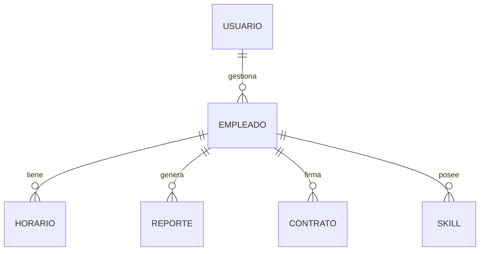

# 🗄️ Base de Datos

Este documento describe la **estructura de la base de datos** y su integración con Django ORM.

---

## 📋 Modelos principales
- Usuario
- Empleado
- Horario
- Reporte
- Contrato
- Skill

---

## 📊 Diagrama Entidad-Relación

---

## 🔐 Seguridad

- Contraseñas hasheadas (PBKDF2 / Argon2).
- Migraciones controladas con `makemigrations` y `migrate`.
- Posibles auditorías con señales de Django.

---
