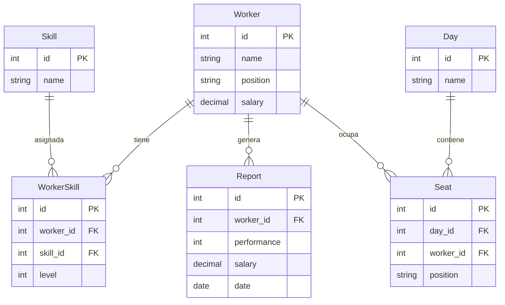

# 🗄️ Modelo de Datos - HDES Intranet

Este documento describe la estructura de base de datos utilizada en **HDES**, incluyendo los modelos principales, sus relaciones y un diagrama ER.

---

## 📋 Modelos

### 👩‍💼 Worker
Representa a un empleado.
- `name` → Nombre completo.
- `position` → Cargo/puesto.
- `salary` → Salario base.

### ⭐ Skill
Representa una habilidad.
- `name` → Nombre de la habilidad (ej: "Ventas", "Atención al cliente").

### 🔗 WorkerSkill
Relación **muchos a muchos** entre `Worker` y `Skill`.
- `worker` → FK a `Worker`.
- `skill` → FK a `Skill`.
- `level` → Nivel de habilidad (1–5).

### 📅 Day
Representa un día de la semana.
- `name` → Nombre (Lunes, Martes, …).

### 🪑 Seat
Representa la asignación de un trabajador en un día y turno.
- `day` → FK a `Day`.
- `worker` → FK a `Worker`.
- `position` → Posición o puesto en el día.

### 📊 Report
Reporte de desempeño de un trabajador.
- `worker` → FK a `Worker`.
- `performance` → Calificación (1–10).
- `salary` → Salario registrado en ese reporte.
- `date` → Fecha del reporte.

---

## 🗺️ Diagrama ER (Mermaid)

---

