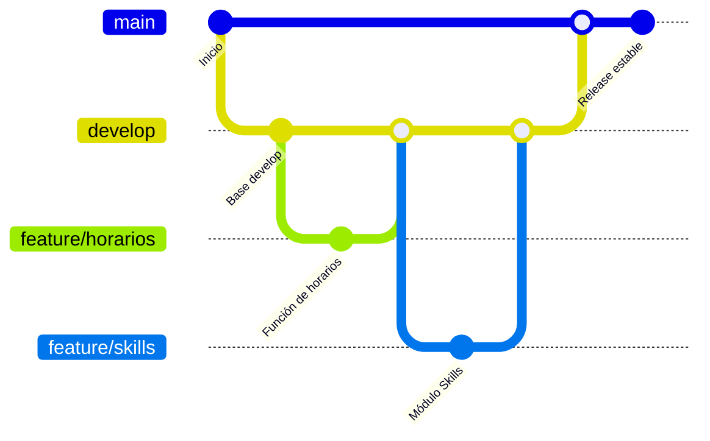

# 🌀 Flujo de Trabajo con Git

Este documento describe las prácticas y el flujo de ramas que seguimos en el proyecto **HDES**.

---

## 🚀 Flujo Git (Gitflow)

Adoptamos el modelo **Gitflow** para mantener un desarrollo ordenado y seguro.

### Ramas principales

- **main** → Versión estable (producción).
- **develop** → Integración de nuevas funcionalidades.
- **feature/*** → Nuevas características.
- **hotfix/*** → Correcciones urgentes.

### Esquema



---

## 📌 Comandos Básicos

### Crear una nueva funcionalidad

```
git checkout develop
git checkout -b feature/nueva-funcionalidad
```

### Subir cambios

```
git add .
git commit -m "Descripción de la funcionalidad"
git push origin feature/nueva-funcionalidad
```

### Fusionar en develop

```
git checkout develop
git merge feature/nueva-funcionalidad
git push origin develop
```

### Preparar una release

```
git checkout main
git merge develop
git tag -a v1.0 -m "Primera versión estable"
git push origin main --tags
```

------

## 🛑 Buenas Prácticas

1. **Commits descriptivos**
   - ❌ `git commit -m "arreglo"`
   - ✅ `git commit -m "fix: corregido bug en asignación de horarios"`
2. **Pull requests obligatorios**
    Nunca hacer merge directo a `main`.
3. **Revisiones de código**
    Cada PR debe ser revisado antes de aprobar.
4. **Branches cortos**
    Las features deben cerrarse en pocos días, no semanas.

------

