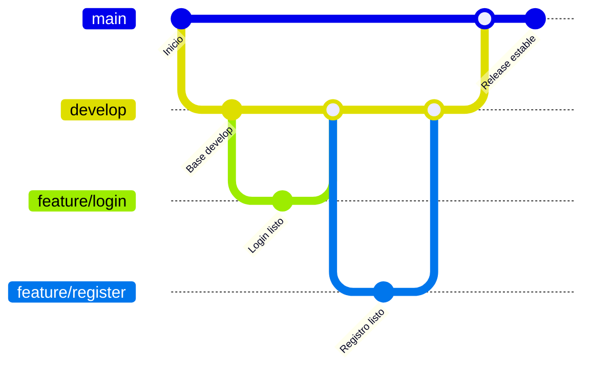

## 🌱 Branch Develop

El branch `develop` es el **entorno de integración** principal del proyecto.  
Aquí se combinan (merge) todos los avances realizados en las ramas de características, hotfix o mejoras antes de que lleguen a `main`.

------

### 🔄 Flujo de trabajo con `develop`

Cada nueva funcionalidad o fix parte desde `develop`:
```bash
git checkout develop
git pull origin develop
git checkout -b feature/nueva-funcionalidad
```

Una vez terminada la tarea, se actualiza la rama con los cambios más recientes de `develop` para evitar conflictos:

```
git checkout feature/nueva-funcionalidad
git merge develop
```

Después de resolver conflictos (si los hubiera), se integra nuevamente en `develop`:

```
git checkout develop
git merge feature/nueva-funcionalidad
git push origin develop
```

------

### 🚧 Objetivo de `develop`

Centralizar el **trabajo en progreso**.

Detectar y resolver conflictos **antes de llegar a producción**.

Mantener `main` siempre **estable y listo para desplegar**.

------

### 🧩 Relación con otros branches



------

### ✅ Buenas prácticas

- Nunca trabajar directamente en `main`.
- Actualizar frecuentemente `develop` para reducir conflictos.
- Hacer **pull requests** hacia `develop` en lugar de merges directos.
- Usar nombres claros en las ramas (`feature/`, `hotfix/`, `bugfix/`).