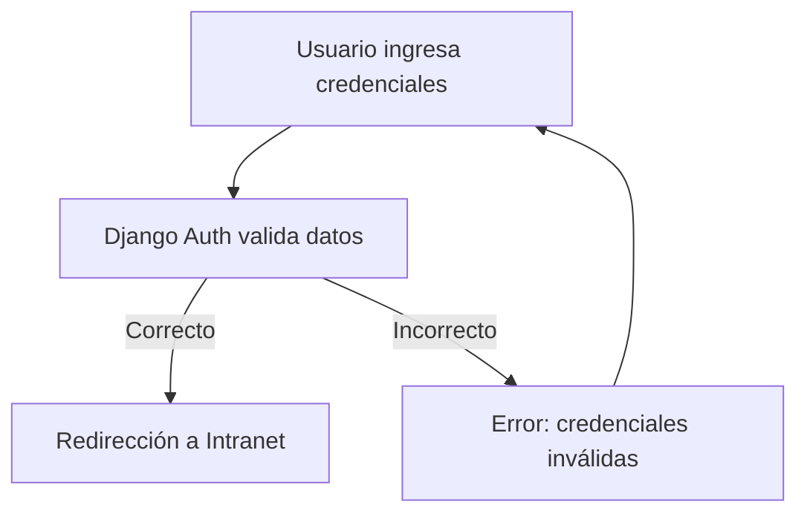

## 🔑 Módulo de Login

El sistema cuenta con un **módulo de autenticación** seguro para garantizar que solo personal autorizado acceda a la intranet.  
El login es el **primer paso de acceso** a los módulos internos (Inventarios, Ventas, Horarios, etc.).

------

### 📋 Características

- **Formulario de Inicio de Sesión** con usuario y contraseña.
- **Contraseñas encriptadas** mediante el sistema de autenticación de Django.
- **Roles de Usuario**:
  - 👩‍💼 **Administrador**: Control total sobre usuarios, inventario y reportes.
  - 🧑‍🔬 **Empleado**: Acceso a ventas, horarios y tareas asignadas.
  - 👨‍⚕️ **Gerente**: Reportes, estadísticas y validaciones.

------

### 🖼️ Mockup de Pantalla (Diseño básico)

```plaintext
+----------------------------------+
|        🏥 Intranet HDES          |
+----------------------------------+
| Usuario: [__________________]    |
| Contraseña: [______________] 🔒  |
|                                  |
| [ Iniciar Sesión ]               |
|                                  |
| ¿Olvidaste tu contraseña?        |
+----------------------------------+
```

------

### 🔐 Flujo de Autenticación



