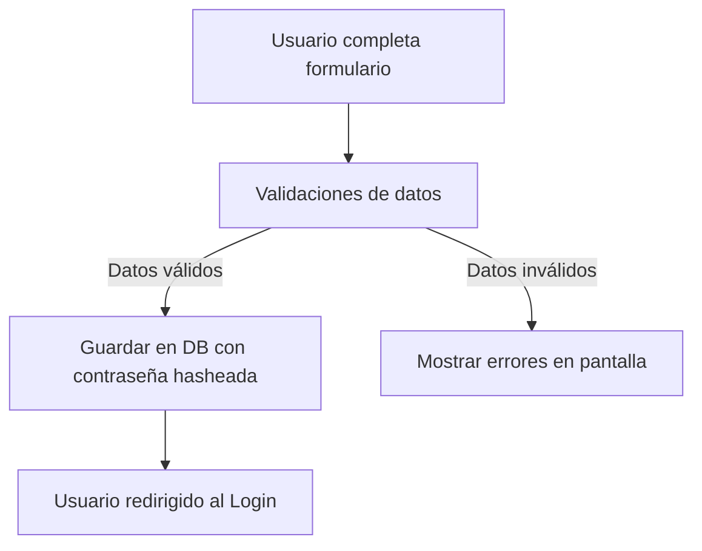

## 📝 Módulo de Registro de Usuarios

El sistema incluye un **formulario de registro** para dar de alta a nuevos empleados, gerentes o administradores de la cadena de boticas.  
Este registro garantiza que cada usuario tenga credenciales seguras y un rol definido dentro de la intranet.

------

### 📋 Características

- **Formulario de Registro** con los siguientes campos:
  - Nombre completo
  - Usuario (nickname)
  - Contraseña (encriptada)
  - Rol (admin, empleado, gerente)
  - Correo de recuperación (opcional)
- **Validaciones**:
  - Usuario único.
  - Contraseña segura (mínimo 8 caracteres, mayúscula, número).
  - Confirmación de contraseña.
- **Asignación de Roles Automática** según permisos del administrador.

------

### 🖼️ Mockup de Pantalla (Diseño básico)

```plaintext
+----------------------------------+
|   🏥 Intranet HDES - Registro    |
+----------------------------------+
| Nombre completo: [___________]   |
| Usuario: [__________________]    |
| Contraseña: [______________] 🔒  |
| Confirmar: [______________] 🔒   |
| Rol: [Admin ▼]                   |
|                                  |
| [ Crear Cuenta ]                 |
|                                  |
| ¿Ya tienes una cuenta? Inicia sesión
+----------------------------------+
```

------

### 🔐 Flujo de Registro



------

### 🚀 Próximos Pasos

- Implementar **verificación por correo electrónico** tras el registro.
- Permitir que solo **administradores** puedan asignar ciertos roles.
- Registro de **logs de creación de usuarios** para control interno.