## 🗄️ Base de Datos en Django (SQLite)

El sistema utiliza la base de datos **SQLite** por defecto de Django.  
Todos los modelos están gestionados mediante **Django ORM**, lo que facilita migraciones, integridad de datos y seguridad sin necesidad de escribir SQL directamente.

---

### 📋 Modelos principales

1. **Usuario**  
   - id (PK, autoincremental – creado automáticamente por Django)  
   - nombre_completo (CharField)  
   - username (CharField, único)  
   - password (CharField → almacenada con hash)  
   - rol (choices: 'admin', 'empleado', 'gerente')  
   - fecha_registro (DateTimeField, auto_now_add=True)  

2. **Producto**  
   - id (PK)  
   - nombre_producto (CharField)  
   - precio (DecimalField)  
   - stock (IntegerField)  
   - categoria (CharField)  

3. **Venta**  
   - id (PK)  
   - usuario (ForeignKey → Usuario)  
   - producto (ForeignKey → Producto)  
   - cantidad (IntegerField)  
   - fecha_venta (DateTimeField, auto_now_add=True)  

4. **ArqueoCaja**  
   - id (PK)  
   - usuario (ForeignKey → Usuario)  
   - monto_inicial (DecimalField)  
   - monto_final (DecimalField)  
   - fecha (DateField)  

---

### 📊 Diagrama Entidad-Relación

```mermaid
erDiagram
    USUARIO {
        int id PK
        string nombre_completo
        string username
        string password
        string rol
        datetime fecha_registro
    }

    PRODUCTO {
        int id PK
        string nombre_producto
        decimal precio
        int stock
        string categoria
    }

    VENTA {
        int id PK
        int usuario_id FK
        int producto_id FK
        int cantidad
        datetime fecha_venta
    }

    ARQUEO_CAJA {
        int id PK
        int usuario_id FK
        decimal monto_inicial
        decimal monto_final
        date fecha
    }

    USUARIO ||--o{ VENTA : "realiza"
    PRODUCTO ||--o{ VENTA : "se venden"
    USUARIO ||--o{ ARQUEO_CAJA : "controla"
```

------

### 🔐 Seguridad en la BD con Django

- **Contraseñas**: manejadas por el sistema de autenticación de Django (hash seguro con `PBKDF2` por defecto, se puede usar BCrypt o Argon2).
- **Integridad**: relaciones y restricciones automáticas con `ForeignKey`.
- **Migraciones**: cualquier cambio en los modelos se gestiona con `python manage.py makemigrations` y `migrate`.
- **Auditoría**: posibilidad de usar señales (`signals`) para registrar logs de cambios y acciones de usuarios.
