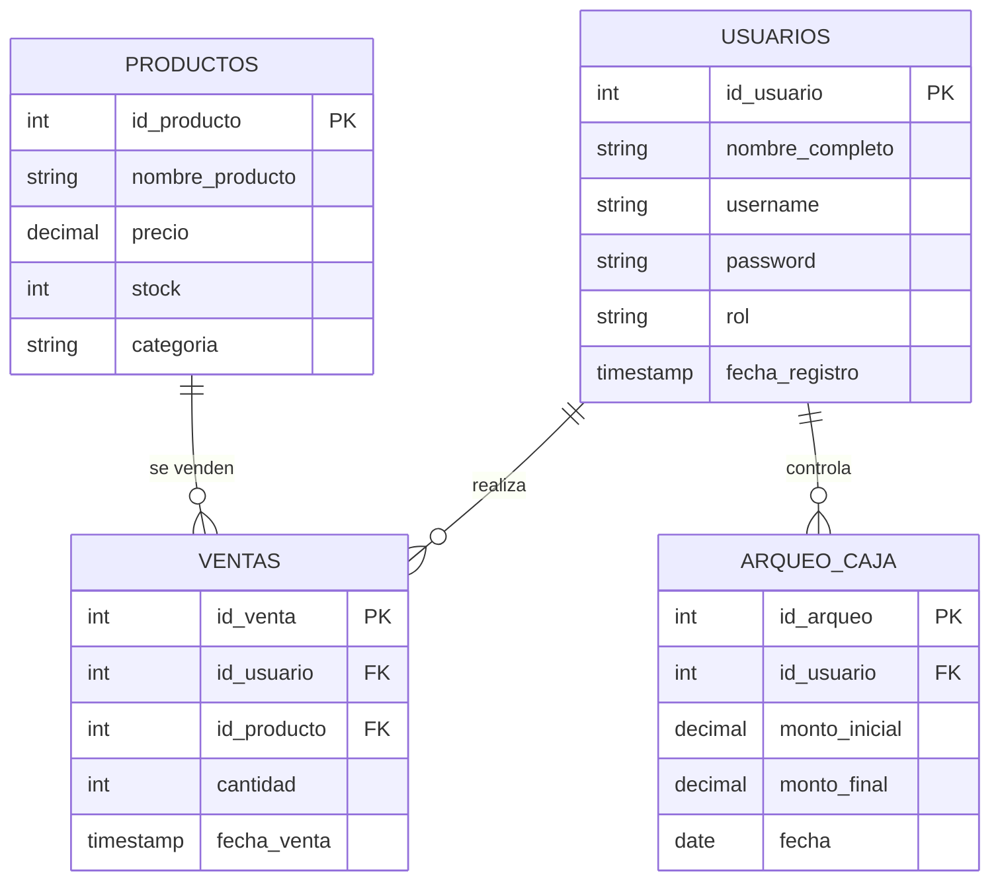

## 🗄️ Base de Datos

El sistema está respaldado por una **base de datos MySQL**, diseñada bajo el patrón **MVC** para mantener los datos organizados, seguros y accesibles.

------

### 📋 Tablas principales

1. **usuarios**
   - id_usuario (PK, autoincremental)
   - nombre_completo (VARCHAR)
   - username (VARCHAR, único)
   - password (VARCHAR, encriptada con hash)
   - rol (ENUM: 'admin', 'empleado', 'gerente')
   - fecha_registro (TIMESTAMP)

2. **productos**
   - id_producto (PK)
   - nombre_producto (VARCHAR)
   - precio (DECIMAL)
   - stock (INT)
   - categoria (VARCHAR)

3. **ventas**
   - id_venta (PK)
   - id_usuario (FK → usuarios)
   - id_producto (FK → productos)
   - cantidad (INT)
   - fecha_venta (TIMESTAMP)

4. **arqueo_caja**
   - id_arqueo (PK)
   - id_usuario (FK → usuarios)
   - monto_inicial (DECIMAL)
   - monto_final (DECIMAL)
   - fecha (DATE)

---

### 📊 Diagrama Entidad-Relación

------

### 🔐 Seguridad en la BD

- Contraseñas guardadas con **hash (SHA-256/BCrypt)**.
- Usuarios identificados por **username único** (no correo).
- Logs de auditoría para controlar actividades sensibles.
- Restricciones de **FK** para mantener integridad referencial.

------

### 🚀 Próximos pasos en la BD

- Agregar tabla de **asistencias** para el control de personal.
- Implementar **backups automáticos.
- Optimizar con **índices** en campos más usados (username, fecha_venta).